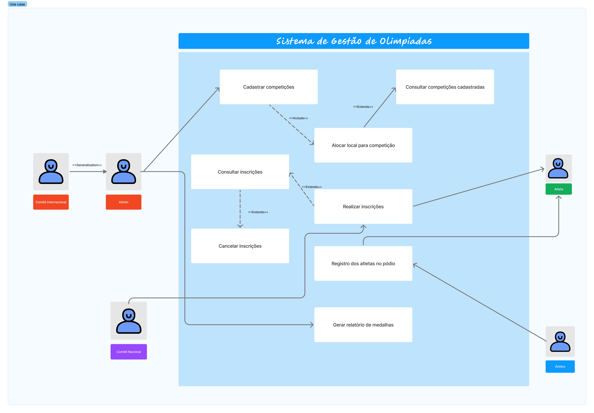
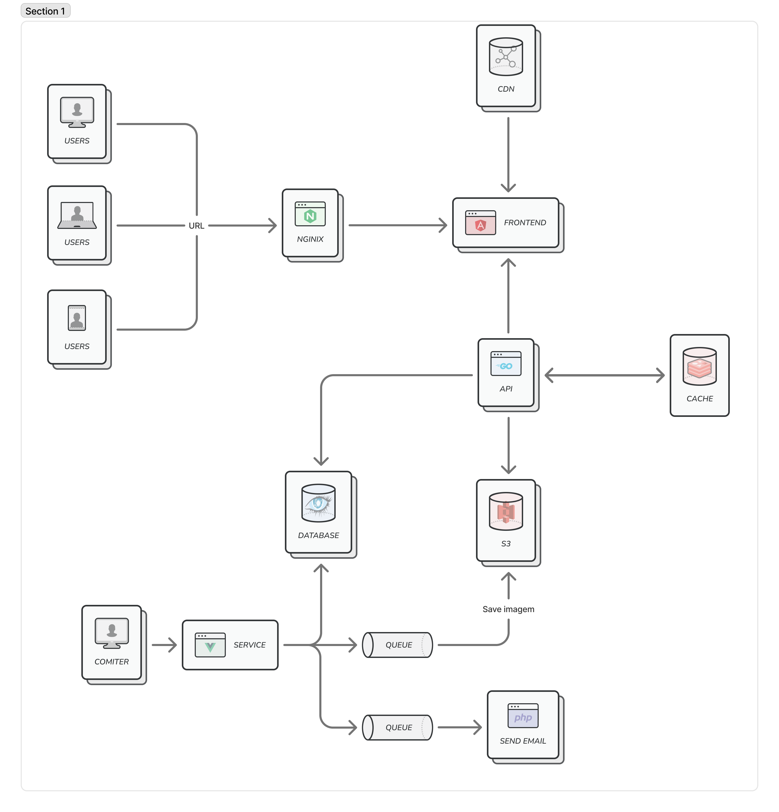
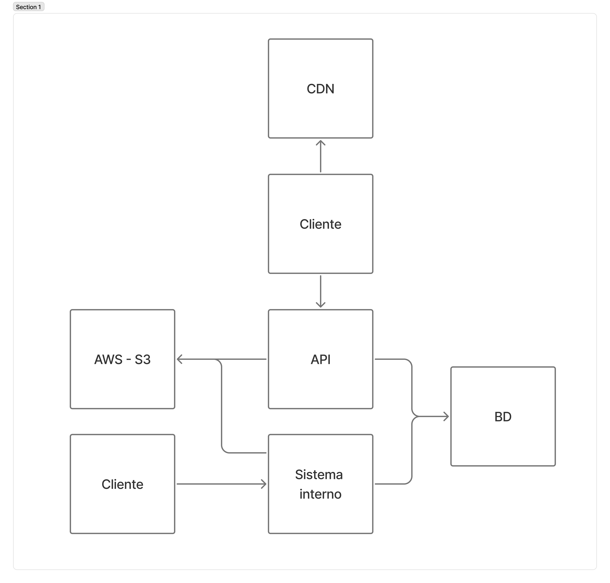

  ![Figma][Figma.io]
  ![Markdown][Markdown.io]

  [![Contributors][contributors-shield]][contributors-url]
  [![Forks][forks-shield]][forks-url]
  [![Stargazers][stars-shield]][stars-url]
  [![Issues][issues-shield]][issues-url]
  [![Unlicense License][license-shield]][license-url]

  <!--  -->

  <h3>S.G.O.</h3>
  Sistema de Gestão das Olimpíadas

# 📖 Sobre
Com a chegada das Olimpíadas, um novo sistema de gestão é
necessário para coordenar os diferentes aspectos do evento. Este sistema deve permitir o
gerenciamento de competições, inscrições de atletas, alocação de locais para as provas,
e controle de resultados.

# 📋 Motivo
Atividade de criação de diagramas elaborada pelo professor [João Aramuni](https://github.com/joaopauloaramuni) da disciplina de Projeto de Software

# 🧾 Historias de usuario
| ID | Titulo | Historia |
|:--:|----|---|
|US01|Gerenciar Competições| Como um **Gerente do Sistema** (ou **Admin**), eu quero **cadastrar novas competições** e **consultar as competições existentes**, para que o **calendário de eventos seja organizado** e **acessível**, e eu **possa acompanhar as competições a serem agendadas**.|
|US02|Gerenciar Locais de Competição	| Como um **Admin** (ou **Gerente do Sistema**), eu quero **alocar ou modificar os locais das competições**, para que **não ocorram conflitos de agendamento** e o **uso das instalações seja otimizado**.|
|US03|Gerenciar Inscrições	| Como um **Oficial**, eu quero **realizar e consultar inscrições de atletas em competições**, e **também cancelá-las se necessário**, para que os **atletas estejam corretamente registrados para seus eventos** e a **participação possa ser gerenciada eficientemente**.|
|US04|Registrar Resultados Pós-Competição	| Como um **Oficial**, eu quero **registrar os atletas que subiram ao pódio para cada competição concluída**, para que os **vencedores sejam oficializados e os dados para o quadro de medalhas sejam atualizados**.|
|US05|Consultar Quadro de Medalhas	| Como um **Comitê Olímpico**, eu quero **gerar um relatório detalhado do quadro de medalhas**, para que eu **possa acompanhar o desempenho dos países e comunicar os resultados oficiais**.|

## 🖼️ Diagramas
Abaixo estão os diagramas do projeto. Clique nas imagens para abrir em tamanho real.

  

    
  

  

    
  

  

    
  

    

    
  

# 🤝 Contribuidores
 

 <!-- Links -->
 <!-- https://github.com/iuricode/readme-template-->
[repossitory-path]: bgluis/SGO-projeto-de-software/
[contributors-shield]: https://img.shields.io/github/contributors/bgluis/SGO-projeto-de-software.svg?style=for-the-badge
[contributors-url]: https://github.com/bgluis/SGO-projeto-de-software/graphs/contributors
[forks-shield]: https://img.shields.io/github/forks/bgluis/SGO-projeto-de-software.svg?style=for-the-badge
[forks-url]: https://github.com/bgluis/SGO-projeto-de-software/network/members
[stars-shield]: https://img.shields.io/github/stars/bgluis/SGO-projeto-de-software.svg?style=for-the-badge
[stars-url]: https://github.com/bgluis/SGO-projeto-de-software/stargazers
[issues-shield]: https://img.shields.io/github/issues/bgluis/SGO-projeto-de-software.svg?style=for-the-badge
[issues-url]: https://github.com/bgluis/SGO-projeto-de-software/issues
[license-shield]: https://img.shields.io/github/license/bgluis/SGO-projeto-de-software.svg?style=for-the-badge
[license-url]: https://github.com/bgluis/SGO-projeto-de-software/blob/master/LICENSE.txt

[Figma.io]: https://img.shields.io/badge/Figma-0ACF83?style=for-the-badge&logo=figma&logoColor=white
[Markdown.io]: https://img.shields.io/badge/Markdown-000000?style=for-the-badge&logo=markdown&logoColor=white
